<p align="center">
  <a href="https://baymax-armed.github.io/Mohammed-Nadeem-Mansoori/"></a>
  <a href="https://www.linkedin.com/in/mohammed-nadeem-mansoori"></a>
  <a href="https://medium.com/@nadeemmansoori05"></a>
  <a href="https://github.com/Baymax-armed?tab=repositories"></a>
</p>

---

## `$ whoami`

```console
$ whoami --verbose
Mohammed Nadeem Mansoori   @Baymax-armed   Mumbai, IN
Senior Application Security Engineer  ·  5+ years  ·  he/him

$ cat ./focus.txt
I break things on purpose so the people shipping them don't have to
find out the hard way — then I build the tooling that keeps it from
happening again. Application security, DevSecOps, cloud security and
the GRC scaffolding that makes it all auditable.

$ cat ./why-open-source.txt
Every platform here is self-hosted, container-first and free.
Good security tooling shouldn't be gated behind an enterprise quote.
```

---

## `$ ls ./builds`

<table>
<tr>
<td width="50%" valign="top">

<h3><a href="https://github.com/Baymax-armed/Voltphish">VoltPhish</a></h3>

<p><b>Phishing simulation &amp; security-awareness platform.</b> A self-hosted alternative to the enterprise suites — email, QR and calendar lures, multi-group targeting, a native report-phish button for Outlook and Gmail, just-in-time training that auto-enrols whoever clicks, human-risk scoring and a full LMS. Stands up in one Docker command.</p>

<p>


<br>


</p>

</td>
<td width="50%" valign="top">

<h3><a href="https://github.com/Baymax-armed/voltmart-pentest-lab">VoltMart Pentest Lab</a></h3>

<p><b>Five intentionally-vulnerable apps in one lab.</b> A store, a retail bank, an investment platform, a multi-tenant SaaS and a dedicated AI/LLM target — 280+ planted vulnerabilities across the OWASP Top 10 and the full OWASP LLM Top 10. The AI assistant runs offline, no API key. A modern answer to DVWA and Juice Shop, with an instructor panel for difficulty.</p>

<p>


<br>

</p>

</td>
</tr>
<tr>
<td width="50%" valign="top">

<h3><a href="https://github.com/Baymax-armed/prompt-forger">Prompt Forger</a></h3>

<p><b>One-click prompt sharpening, no API key.</b> Rewrites a rough prompt into a precise one in place, on ChatGPT, Claude, Gemini and AI Studio. Nothing leaves the browser.</p>

<p>


</p>

</td>
<td width="50%" valign="top">

<h3><a href="https://github.com/Baymax-armed/Mohammed-Nadeem-Mansoori">Portfolio</a></h3>

<p><b>Hand-built static site.</b> No framework, no build step, self-hosted fonts, reduced-motion aware. The long-form version of this page.</p>

<p>


</p>

</td>
</tr>
</table>

---

## `$ cat ./stack.txt`

```console
AppSec        threat modelling · secure code review · SAST/DAST/SCA
              Burp Suite · OWASP ZAP · Semgrep · Nuclei · OWASP ASVS

DevSecOps     pipeline security gates · dependency & container scanning
              GitHub Actions · Docker · Trivy · secrets detection

Cloud         Azure & AWS security posture · IAM & least privilege
              workload identity · SSRF-to-metadata hardening

GRC           ISO 27001:2022 · DPDPA · SOC 2 readiness · policy as code
              risk registers · audit evidence automation

SecOps        detection engineering · incident response · phishing defence
              human-risk analytics · security awareness programmes

Build with    Python · TypeScript · React · FastAPI · PHP · SQL · Bash
```

---

## `$ ls ./credentials`

<p>
  
  
  
  
</p>

---

## `$ curl /contact`

```console
$ contact --open-to
  · security research collaborations and CVE write-ups
  · contributions to VoltPhish and VoltMart — issues and PRs welcome
  · speaking or workshops on AppSec, phishing defence and LLM security
```

<p>
  <a href="https://www.linkedin.com/in/mohammed-nadeem-mansoori"></a>
  <a href="https://medium.com/@nadeemmansoori05"></a>
</p>

<sub><code>// found a bug in something of mine? open an issue, or reach me privately on LinkedIn.</code></sub>
